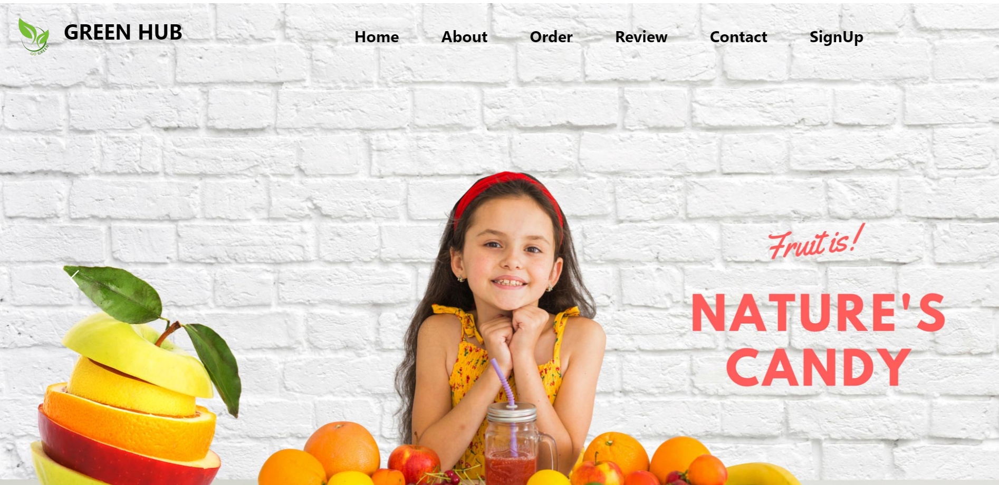

# GREEN MARKET HUB

At [Green Market Hub], we are dedicated to bringing you the freshest and finest selection of fruits and vegetables. Our mission is to provide our community with access to healthy, locally-sourced, and seasonal produce to promote a balanced and nourishing diet.

[website URL](https://github.com/achaltelmasre/green-market-hub)

[Live Website](https://github.com/achaltelmasre/green-market-hub)

### Our Mission
To source a range of quality fruits from across the globe and deliver them fresh to customers across India.

### Our Vision
To be the most trusted and preferred Indian fruit trading business. Our vision calls us to earn trust and create value for our key stakeholders: Growers: By enabling their fruits reach from their farms to different regions in India Wholesalers: By ensuring they receive fruits fresh, every day, every time Consumers: By satiating their taste preferences through a gamut of fruit offerings

#### Key Features
- Fresh Produce
- Local and Organic
- Friendly Service
- Affordable Prices
- Affordable Prices
- Seasonal Specials
- Clean and Hygienic
- Delivery Services

At [Green market Hub], we believe that the foundation of a healthy lifestyle starts with the food you eat. We are committed to helping you make better food choices by providing a diverse range of high-quality fruits and vegetables. Visit us today and experience the freshness and taste that only a local, dedicated greengrocer can offer.

